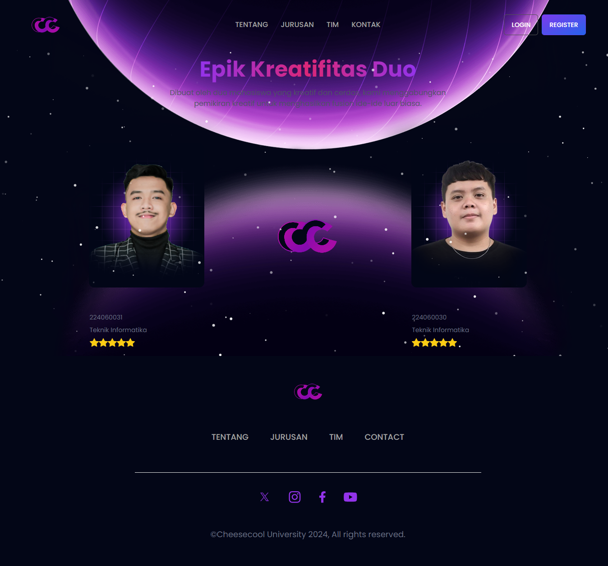
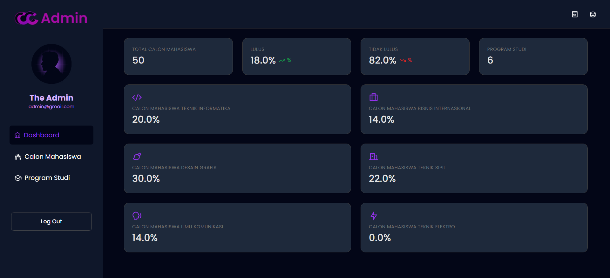

<h1 align="center"> CheeseCool University </h1> <br>
<p align="center">
    
</p>

<p align="center">
  Selamat Datang di Universitas terbaik di Indonesia
</p>

## Table of Contents

-   [Introduction](#introduction)
-   [Features](#features)
-   [Contributors](#contributors)
-   [Technologies](#technologies)
-   [Getting Started](#getting-started)

## Introduction

Selamat datang di Universitas CheeseCool, sebuah platform pendidikan inovatif yang berpusat pada mahasiswa, dirancang untuk memberikan pengalaman belajar yang luar biasa bagi siswa dan pendidik. Misi kami adalah menciptakan lingkungan yang mendukung dan menginspirasi yang mendorong keunggulan akademik, pertumbuhan pribadi, dan pengembangan profesional.

**Demo Preview**


<p align="center">
  
</p>
<p align="center">
  
</p>

## Features

-   **Dasbor Komprehensif:** Akses semua informasi penting dan kelola aktivitas akademis Anda dengan mudah.

-   **Manajemen Mahasiswa:** Pantau kemajuan siswa, kelola pendaftaran, dan berkomunikasi secara efektif.

-   **Manajemen Program:** Jelajahi berbagai program dan kursus yang ditawarkan, memastikan kurikulum yang beragam dan inklusif.

-   **Sidebar Interaktif:** Navigasi platform dengan sidebar yang intuitif dan ramah pengguna.

-   **Profil Pengguna:** Pertahankan dan perbarui informasi profil Anda, menjaga detail akademis dan pribadi Anda tetap terbaru.

-   **Desain Responsif:** Nikmati pengalaman yang mulus di semua perangkat, berkat desain responsif dan adaptif kami.

**Admin Preview**

<p align="center">
  
</p>

<p align="center">
  
</p>

<p align="center">
  
</p>

**Mahasiswa Preview**

<p align="center">
  
</p>

<p align="center">
  
</p>

## Contributors

Proyek ini mengikuti [Kontributor](https://github.com/Ilhanhj/cheesecool-project), kami menyambut kontribusi dari komunitas! Jika Anda tertarik untuk berkontribusi ke Universitas CheeseCool, silakan ikuti pedoman kontribusi kami untuk memulai.

## Technologies

-   [![JavaScript][javascript-badge]][JavaScript-url]
-   [![PHP][php-badge]][php-url]
-   [![Tailwind CSS][tailwindcss-badge]][TailwindCSS-url]
-   [![Laravel][laravel-badge]][Laravel-url]

[javascript-badge]: https://img.shields.io/badge/JavaScript-F7DF1E?style=for-the-badge&logo=javascript&logoColor=black
[JavaScript-url]: https://www.javascript.com
[php-badge]: https://img.shields.io/badge/PHP-777BB4?style=for-the-badge&logo=php&logoColor=white
[php-url]: https://www.php.net
[tailwindcss-badge]: https://img.shields.io/badge/TailwindCSS-38B2AC?style=for-the-badge&logo=tailwind-css&logoColor=white
[TailwindCSS-url]: https://tailwindcss.com
[laravel-badge]: https://img.shields.io/badge/Laravel-FF2D20?style=for-the-badge&logo=laravel&logoColor=white
[Laravel-url]: https://laravel.com

## Getting Started

Pastikan Anda telah mengatur environment dengan benar. 
Tools yang dibutuhkan :

- PHP 8.2 
- MySQL/MariaDB
- Composer
- Git/Gitbash
- Node.js

#Installation

- Untuk menjalankan  aplikasi ini buka terminal lalu ikuti perintah berikut :

```bash
# Clone this repository
$ git clone https://github.com/Ilhanhj/cheesecool-project.git

# Go into the repository
$ cd cheesecool-project

# Install dependencies
$ npm install
$ composer install

# Copy Environment
`cp .env.example .env`

# Generate Key
$ php artisan key:generate

# Import Database
- Buat database dengan nama cheesecool_project
- Buka file database `cheesecool_project.sql` yang berada di folder utama lalu import di localhost phpmyadmin.

# Configure Databases
$ php artisan migrate:fresh --seed

# Run the app
- Buka 2 terminal untuk menjalankan 2 command line dibawah ini

$ npm run dev
$ php artisan ser

# Login
Email : admin@gmail.com
Pass  : 123123123
```

## License

The Laravel framework is open-sourced software licensed under the [MIT license](https://opensource.org/licenses/MIT).
